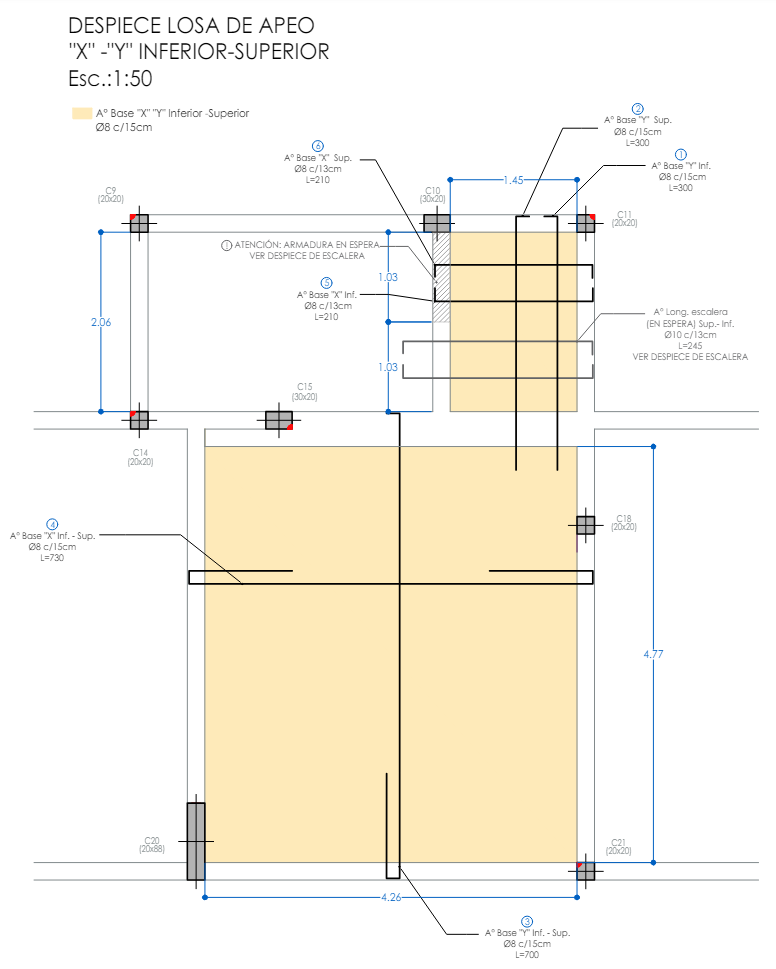

  <h1> LOSAS CYPE</h1>
  

  Author:
  <a href="" target="_blank">Fundamenta Ing.</a> 
  <small> April, 2023</small>
  

[<< Home](https://github.com/FUNDAMENTA-ING/FUNDAMENTA-DOC/blob/main/README.md) | [Seccion 2 >>](https://github.com/FUNDAMENTA-ING/FUNDAMENTA-DOC/blob/main/README.md)

### ARMADO INFERIOR X e Y 

### CONSTRUCTIVO/EJECUTIVO

> [!IMPORTANT]  
> TENER CUIDADO AL CRUZAR BARRAS DE ARMADO DE LOSAS POR MAS DE UNA VIGA POR LA INTERFERENCIA QUE GENERA A LA HORA DE ARMARLAS, SE ADMITE DOBLAR LA ARMADURA INFERIOR PARA CUBRIR LA SUPERIOR CUANDO DEBAJO DE LA LOSA EXISTEN TABIQUES O EN EL CASO DE LAS PILETAS, PERO ESTAS ARMADURAS PUEDEN INTERFERIR EN LOS CASOS DE CRUZAR MUCHAS VIGAS

  

En POS4 se admitio el doblez porque se apoya en tabiques mientras que en POS2 se prefirio separar las barras

### BASICO
1. Vamos a Isovalores
2. Ver - Hipotesis y Plantas
3. Esfuerzos de dimensionamiento - Momento en X/Y, Cuantia Inferior/Superio - Podemos cambiar valores maximos y minimos para pueda diferenciase mejo donde van los refuexos
4. Usar Medidas de barra tipicas donde sea posible, colocar  empalmes intercalados donde haga falta, preferentemente deja una barra de 12m y cortar la otra barra, no usar dos  barras de 7m para llegar a 14m
> [!IMPORTANT]  
> VERIFICAR LA DIRECCION PRINCIPAL DE ARMADO Y EL COMPORTAMIENTO DE LAS LOSAS VIENDO LAS DEFORMADAS AVECES UNA LOSA MUY FINA PUEDE PEDIR ARMADO EN LA LONGITUD MAS LARGA COMO SI FUERA UNA VIGA.
   

### CRITERIOS DE ARMADO BASE
1. Ponemos un armado base segun lo que pide el cype o minimo: 2*REDONDEAR.MAS(ESPESOR DE LA LOSA - "2.5" RECUBRIMIENTO )--- Ej: Losa de 15cm tiene 13cm de altura efectiva, la separacion minima segun espeso seria 26cm 
2. Cubrimos donde haga falta hasta llegar a cubrir con una cuantia minima de 0.12 donde no haya nada, donde haya +0.00 PONEMOS REFUERZO TAL QUE CUBRA MINIMO 0.14%

### CRITERIOS DE REFUERZO

1. Podemos incluso usar refuerzos cada 4 veces 2*REDONDEAR.MAS(ESPESOR DE LA LOSA - "2.5" RECUBRIMIENTO ) ej en una losa de 15 fi 8 c/52cn
2. Nos alejamos un poco a la hora de ver la isolinea para poner refuerzos.. reforzamos donde la banda es extendida y restamos importancia a los esfuerzos muy concetrados  a la hora de poner bandas de distribucion.. sobre todo en este caso que tenemos tabiques

  

3. Cuando tenemos barras que se cotan en un hueco contamos la cantidad de seccion que se corta y la ponemos en la otra direccion como refuerzo puntual

#### BASICO
5. Vamos al la planilla - Esfuerzos ( ponemos un armado y un valor en esfuerzos As nec tiene q ser apoximadamente igual a Asasumtotal)-buscamos q los refuerzos sean de la misma separacion q la rmadura base para que sea una barra mas en el medio de la base
6. El ancho de la banda de distribucion dividido en la separacion de las barras deb se un numeo entero de barras. se redondea un poquito para q termine en 0 ej 3.92 a 3.90
7. para los refuezos minimo ponemos barras de 1.50
8. Lasbarras de refuerzo y base q llegan  a los bordes llevanganchos son del espesor de la losa menos dos veces el recubrimieno ej losa de 20 lleva ganchos de 15
9. Los ganchos de armados superiores van hacia abajo de armados inferiores hacia arriba
10. Si tengo un tabique o una viga gande abajo de la losa debo alagar las patitas de las barras mas del espeso de la losa segun cortes de barras
11. Lago de las patitas  minimo: fi16-L=2m-P20 fi20-L=2.40m-P30 fi25-L=2.40-P45. Las patitas van  a 2cm del bode externo para q se vean y no se superpongan con las rayas
12. Si tengo momento tengo que cubrir todo con "Cuantia Sum. minima de 0.14 donde hay mucho 0 puedo poner armado basede cuantia sum. minima de .12"
13. baras de mas de 12m dejar una barra de 12 y el resto una barrita paraahorra corte.
14. ojo dondetengo vigas la barra entra dentro
15. En caso de no pode llega a las longitudes de barra estandar usar longitudes lo mas redondas posibles en 100 200 300 400 500 600 700 u 150 250 350 450  u 155 165 160 ( en 0 5) evitar medidas tipo 177
16. La separacion maxima  de las barras en armado de losas en general es el espesor  por 2 menos el reubrimiento  ej una losa de 15 tiene una separacion maxima de 13 , el armado base engeneal es bueno porq sirve de sopote para las otras barras..
17. A veces no habra nada que hacerle y  nose podra poner la longitud y ancho ideal que queramos
    pp
    
#### ARMADO DE LOSAS PEQUEÑAS
 - Podemos no ponerle armado superior
 - Podemos usar Fi6c/15
 - Podemos usar mallas Q188

#### ARMADO DE LOSAS DE VIGUETAS
 - TRATAMOS Q LAS LONGITUDES Q FIGURAN EN LA PLANILLA SEAN MULTIPLOS DE 0.20 para que puedan comprar los cortes
 - PONEMOS LA LUZ Y EL ANCHO DE INFLUECIA MEDIDOS HASTA EJES DE VIGAS
 - LUEGO PONEMOS EL TIPO DE VIGUETA SEGUN :
 - ASTER 1 - 3
 - A1 3.2 - 3.4
 - A2 3.6 - 8.6
 - B1 4.0 - 4.2
 - B2 4.4 - 4.6
 - C 4.8 - 5.4
 - D 5.6 - 6.2
 - E 6.4 - 7.2

 - Segun educype recomienda poner coeficiente de empotramiento 0 en todos los bordes de las losas de viguetas
    
