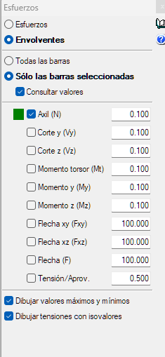
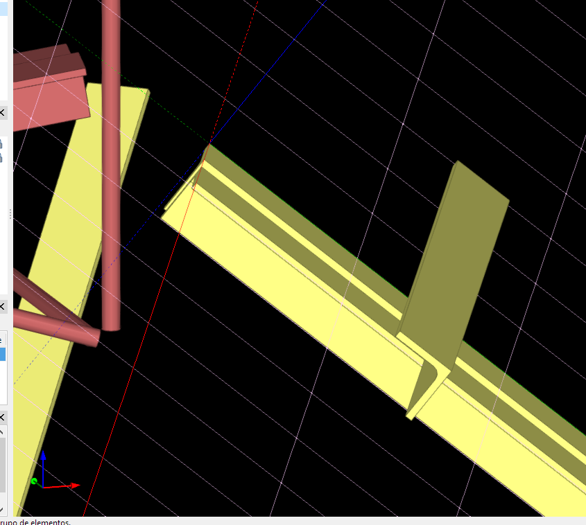
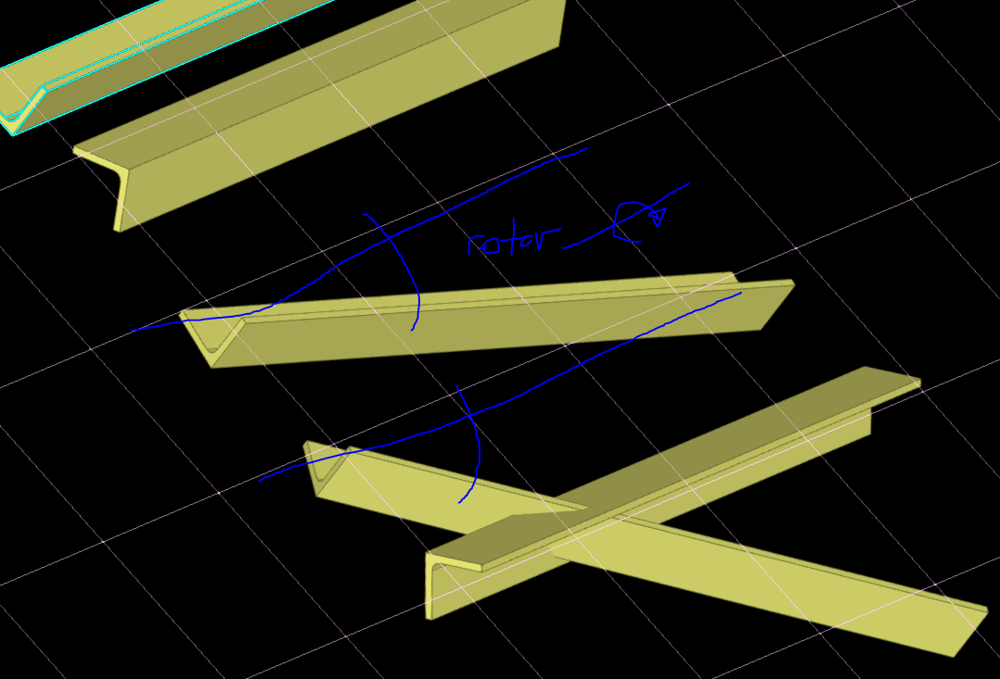
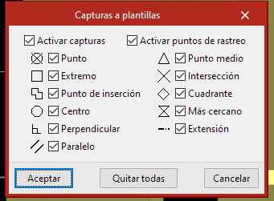

  <h1> DATOS GENERALES STRUBIM</h1>
  

  Author:
  <a href="" target="_blank">Fundamenta Ing.</a> 
  <small> April, 2023</small>
  

[<< Home](https://github.com/FUNDAMENTA-ING/FUNDAMENTA-DOC/blob/main/README.md) | [Seccion 2 >>](https://github.com/FUNDAMENTA-ING/FUNDAMENTA-DOC/blob/main/README.md)

### DATOS GENERALES

### ESPESOR DE PLACAS
- 1/2" - 12.7mm
- 5/8" - 16mm
- 3/4 - 19mm

  
### TORNILLOS
- ASTM F3125 3/4"
- A325 Type1
- Separacion minima 1.5 diametro o 50mm

### PERFILES
- W F36
- Placas F26 y demas

### SOLDADURA
- E70XX
- Espesores Tipo 6 8 10 12
- ESPESOR MAXIMO IGUAL A LA MENOR DIMENSION DE LOS ELEMENTOS A UNIR

### AGRUPAR UNIONES

- Antes de agrupar uniones hay q ver q los esfuerzos en CYPE 3D sean los maximos en esa union respecto al resto esto es MUY IMPORTANTE, activar asi:

   

### COPIA DE SEGURIDAD SE GUARDA
 - Cambiar el $ por la l 
 - C:\CYPE Ingenieros\Proyectos\StruBIM Steel

### TIPS

 - CON INVERTIR SENTIDO DEL EJE X PODEMOS DAR VUELTA EL PERFIL EN DOS CLICS LO SLECCIOAMOS y DAMOS CLICK DERECHO Y SE GIRA EN EL EJE X!!!!!!!!! SUPREMAMENTE UTIL!

 - USAR SIEMPRE QUE SE QUIERA CREAR DIAGONALES O ELEMENTOS EN PLANOS INCLINADOS ! PLANOS DE TRABAJO ! ACTIVAR LA REJILLA PUEDE SER MUY UTIL
 - Presionando shift mientras movemos podemos mover sobre los ejes del plano de referencia creado perpendicularmente
 - Cuando definimos un plano de refencia se crean nuevos ejes basados en los puntos q se usaron para definir el plano estos ejes se toman como referencia para mover un objeto 

   

 - Con rotar giramos los elementos respecto al plano de referencia

   

 - Es muy util activar captura a la hora de mover los perfiles porq ayuda arefernciar el movimiento

   

 - Con rotar despues de seleccionada la seccion rotamos respecto al eje de la seccion

 - Con los puntos fijos solo movemos el perfil respecto al punto de insercion pero no procira el giro del a seccion sobre su baricentro
   
 - CON SIMETRIA PODEMOS COPIAR EL ELEMENTO Y ESPEJARLO
 - CON ROTAR PODEMOS GIRARLO RESPECTO A UN EJE
 - CUANDO SELECCIONAMOS MOVER PODEMOS USAR EL MODO 3D O EL 2D ESTO ES SUPER UTIL !!!
 - ALINEAR TAMBIEN ES SUPER UTIL PODEMOS ALINEAR CARAS DE ELEMENTOS CON CARAS DE OTROS ELEMENTOS EXISTENTES DE ESTE MODO CONSEGUIMOS PLANOS PARALELOS ENTRE LOS PLANOS DE LOS ELEMENTOS
   

### VERIFICAR EN MODELADO DE UNION

- [ ] Carga sobre elemento principal  
- [ ] Espesores de elementos  
- [ ] Largo de las barras
- [ ] Espesores de soldaduras  
- [ ] Von Mises Maxima 190 MPa
- [ ] Aprovechamiento máximo 60%
- [ ] Empotramiento en Cype 3D , 0.10 Articulado, 0.30 o mas Empotrado
- [ ] Simetria de los tornillos respecto a su eje.
- [ ] Verificar el esfuerzo maximo en Cype 3D

### VERIFICAR DOCUMENTACION DE UNION

- [ ] Que no se crucen las cotas, que esten acotados los tornillos
- [ ] Que esten las placas acotadas con nombre
- [ ] Simetria de los tornillos respecto a su eje
- [ ] Acotar agujeros inferiores y superiores en diagonales en x e y, ademas de el numero de agujeros (cambiar la palabra taladro por agujeros en la etiqueta ) mejor si es en todas las placas

